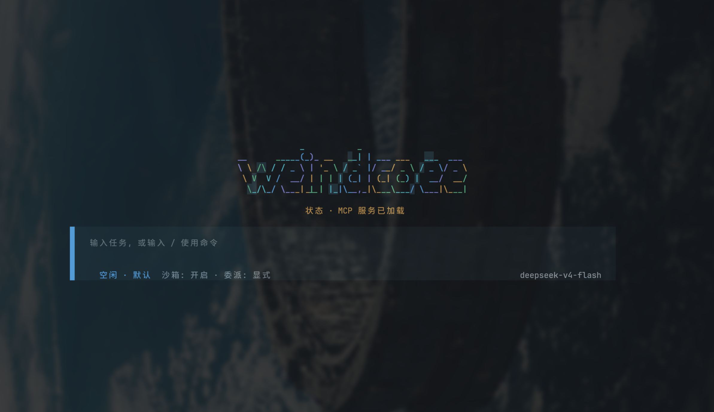
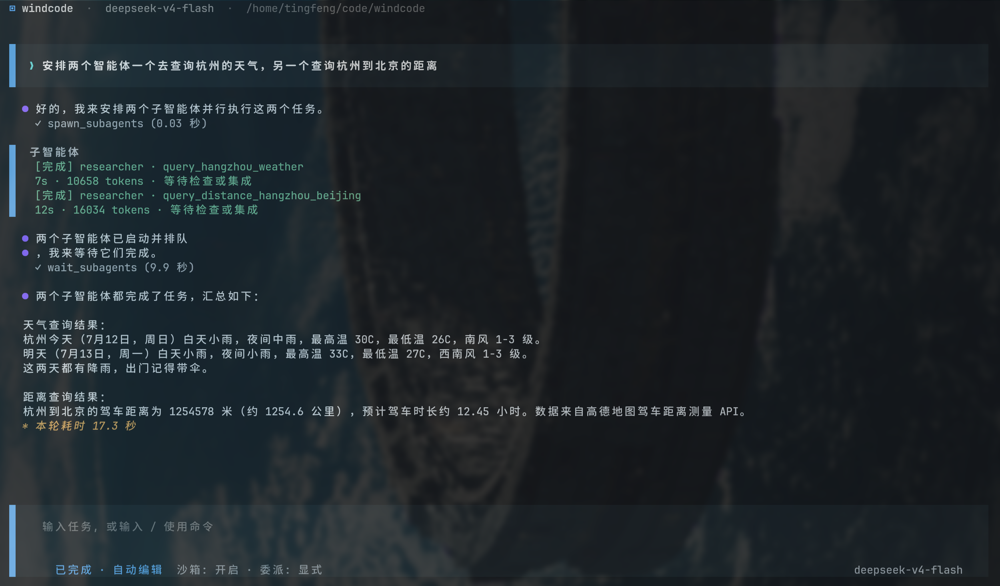
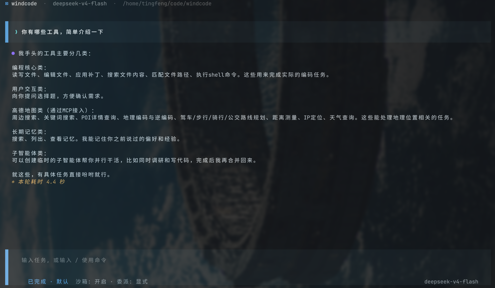
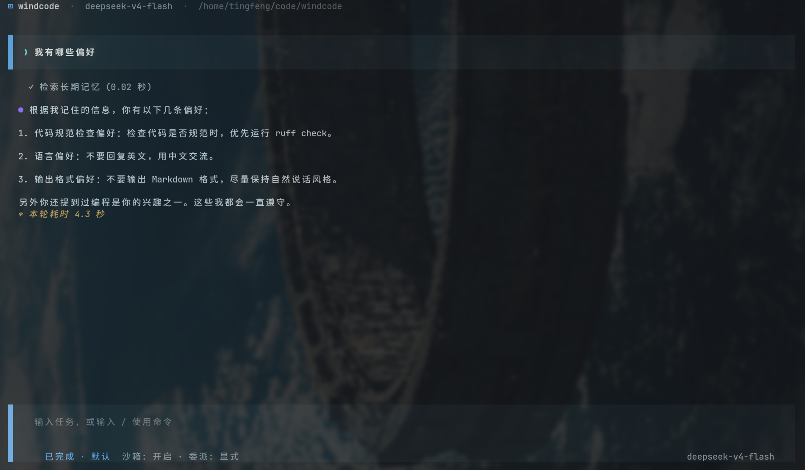
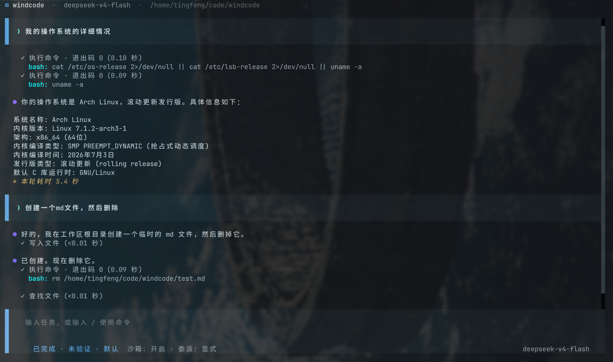

# Windcode

Windcode 是一个Coding Agent。它可以在本地
工作区中读取和修改代码、执行命令、运行测试、恢复会话，并通过权限策略与 Linux 沙箱控制
高风险操作。







## 功能

- Textual 终端工作台与 Python SDK
- Anthropic Messages、OpenAI Responses 和 OpenAI-compatible 模型协议
- 流式输出、工具调用、审批、取消、重试与显式模型回退
- 会话恢复、历史回退、上下文压缩和本地 trace
- 多子智能体并行执行与独立 Worktree
- 项目级长期记忆：用户画像、项目事实、经验、SOP 与主动查询
- MCP Server、Skills、Hooks 和本地插件扩展
- 四种权限模式与 Linux Bubblewrap、macOS Seatbelt 沙箱后端


## 快速开始

环境要求：Linux、macOS 或 Windows，Python 3.11+、[uv](https://docs.astral.sh/uv/)。

Linux 使用 Bubblewrap，macOS 使用 Seatbelt。Windows 暂不提供系统级进程沙箱，PowerShell
命令通过权限策略逐次授权；`full_access` 模式下可按配置直接执行。

沙箱 preset 为 `read_only`、默认的 `workspace_write` 和显式的
`danger_full_access`。旧配置 `enabled=true/false` 仍可读取，并分别映射到
`workspace_write/danger_full_access`。命令联网和沙箱外运行单独审批；项目级命令前缀规则保存
在 state root 的 `permissions/projects/`，不会写入仓库。

从 PyPI 安装命令行工具：

```bash
uv tool install windcode
windcode /path/to/project
```

也可以安装到当前 Python 环境：

```bash
uv pip install windcode
```

从源码运行：

```bash
uv sync --frozen --all-groups
cp .windcode/config.toml.example .windcode/config.toml
uv run windcode /path/to/project
```

最小模型配置：

```toml
primary_provider = "primary"

[providers.primary]
protocol = "openai_compatible"
model = "your-model"
base_url = "https://example.com/v1"
api_key_env = "MODEL_API_KEY"
```

密钥应通过环境变量或 Windcode 凭据存储提供，不要写入项目配置。

```bash
export MODEL_API_KEY="..."
uv run windcode .
```

常用启动参数：

```text
--config FILE
--model PROVIDER_OR_MODEL
--resume SESSION_ID
--permission-mode plan|default|accept_edits|full_access
--sandbox / --no-sandbox
```

## 常用命令

```text
/new                         新建会话
/resume [SESSION_ID]         恢复会话
/history                     查看历史节点
/rewind RECORD_ID            回退到历史记录
/model                       管理模型与 Provider
/mode MODE                   切换权限模式
/memory                      管理长期记忆
/extensions                  管理扩展
/compact                     压缩当前上下文
/agents                      查看子智能体
/status                      查看运行状态
```

## MCP Server

```toml
[extensions]
enabled = true

[extensions.mcp_servers.example]
transport = "streamable_http"
url = "https://example.com/mcp"
enable = true
required = false
```

`enable = false` 的服务器不会连接、不会参与工具搜索，也不会注入模型上下文。`required` 只在
服务器启用时表示启动阶段主动连接；连接失败会显示降级状态，但不会阻断普通消息。扩展系统和
内置的 `gaodemap-mcp` 默认开启。

## 本地状态

Windcode 将记忆、会话、trace、扩展状态和 Worktree 统一存放在选定的状态根下：

```toml
[storage]
project_state_root = ".windcode"
user_storage_root = "~/.windcode"
```

用户级配置固定读取 `~/.windcode/config.toml`；项目中的 `.windcode/config.toml` 优先级更高。
配置项目状态根时优先使用项目目录；未配置时使用 `~/.windcode`。Skill 会同时扫描两边的
`skills/`，同名时项目级覆盖用户级。项目 `.windcode/config.toml` 和 `.windcode/` 下的运行
状态都不应提交到 Git。

## 开发

```bash
uv run ruff format --check .
uv run ruff check .
uv run pyright
uv run pytest -q
uv build
```

## 构建与发布

发布前更新 `pyproject.toml` 和 `src/windcode/__init__.py` 中的版本号，并完成完整检查：

```bash
uv sync --frozen --all-groups
uv run ruff format --check .
uv run ruff check .
uv run pyright
uv run pytest -q
uv build --no-sources
```

可以先发布到 TestPyPI 验证：

```bash
uv publish \
  --publish-url https://test.pypi.org/legacy/ \
  --token "$TEST_PYPI_TOKEN"
```

正式版本通过 GitHub Release 自动发布：创建与项目版本一致的标签，例如 `v0.1.0`，然后发布
GitHub Release。`.github/workflows/publish.yml` 会验证标签、运行测试、构建发行包，并使用
PyPI Trusted Publishing 发布。首次发布前需要在 PyPI 配置以下 Trusted Publisher：

```text
Owner: tingfeng347
Repository: windcode
Workflow: publish.yml
Environment: pypi
```

PyPI 不允许覆盖已经发布的同名版本；重新发布前必须增加版本号。

生产代码位于 `src/windcode/`。本地 `tests/` 与 `spec/` 目录由 Git 忽略，仅用于开发和规格管理。

## License

[Apache-2.0](LICENSE)
